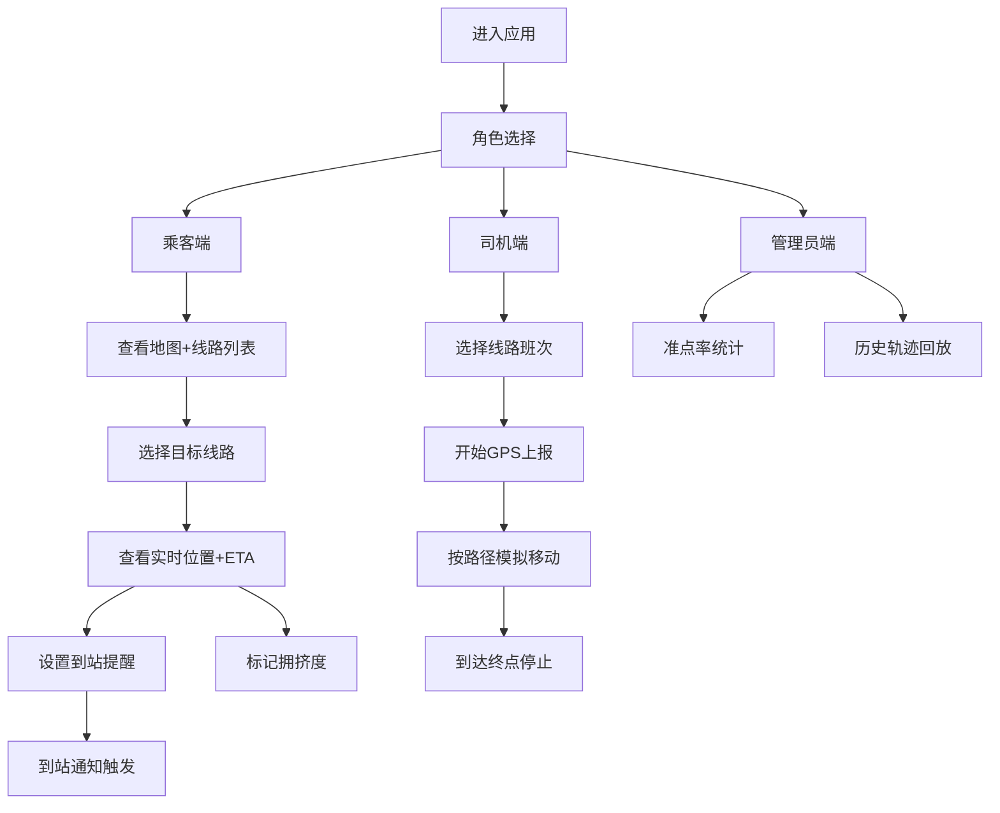

## 1. 产品概述

园区摆渡车实时位置追踪系统，解决园区内通勤人员等车难、信息不透明的痛点。司机端实时上报GPS位置，乘客端可查看各线路车辆当前位置、预估到达时间，支持到站提醒、拥挤度反馈，以及历史轨迹和准点率统计分析。

- 目标用户：园区通勤员工（乘客端）、摆渡车司机（司机端）、园区运营管理员
- 核心价值：提升乘车体验、减少等车焦虑、优化调度效率、提供数据决策支持

---

## 2. 核心功能

### 2.1 用户角色

| 角色 | 登录方式 | 核心权限 |
|------|----------|----------|
| 乘客 | 身份选择进入 | 查看车辆位置、ETA、设置到站提醒、标记拥挤度、查看历史数据 |
| 司机 | 身份选择进入 | 选择线路/班次、开启/停止GPS上报、查看运行状态 |
| 管理员 | 身份选择进入 | 查看全部运营数据、准点率统计、历史轨迹回放 |

### 2.2 功能模块

1. **乘客端首页**：线路总览卡片、地图视图（显示所有运行中车辆）、快捷入口
2. **线路详情页**：站点列表+进度、车辆实时位置标记、预估到达时间、到站提醒开关、拥挤度显示
3. **司机端控制台**：线路选择、班次信息、GPS上报开关、当前位置状态、运行计时
4. **拥挤度反馈**：乘客端可对当前乘坐车辆进行"宽松/一般/拥挤"标记
5. **统计分析页**：历史轨迹回放、线路准点率图表、各时段拥挤度热力图

### 2.3 页面详情

| 页面名称 | 模块名称 | 功能描述 |
|----------|----------|----------|
| 身份选择页 | 角色卡片 | 三个角色入口卡片：乘客/司机/管理员，点击进入对应视图 |
| 乘客首页 | 地图区域 | SVG模拟园区地图，展示线路走向、站点、车辆实时位置动画 |
| 乘客首页 | 线路卡片列表 | 各线路状态卡片：运行车辆数、最近一班距离、拥挤度概览 |
| 线路详情 | 站点时间轴 | 横向站点列表，高亮当前站点，显示车辆位置和各站ETA |
| 线路详情 | 提醒设置 | 选择目标站点，开启到站提醒（模拟浏览器通知） |
| 线路详情 | 拥挤度反馈 | 三档按钮反馈，实时更新车辆拥挤度指标 |
| 司机控制台 | 线路班次选择 | 下拉选择线路和当前班次 |
| 司机控制台 | GPS上报面板 | 开始/停止按钮，位置模拟进度条，已运行时长 |
| 统计分析 | 准点率仪表盘 | 各线路准点率环形图、月度趋势柱状图 |
| 统计分析 | 轨迹回放 | 选择日期和线路，回放车辆全天运行轨迹 |

---

## 3. 核心流程

### 乘客主流程
乘客选择角色 → 进入首页查看地图和线路 → 点击目标线路 → 查看车辆位置和各站ETA → 设置目标站点提醒 → 到达时收到通知 → 上车后可反馈拥挤度

### 司机主流程
司机选择角色 → 选择当前驾驶线路和班次 → 点击开始运行 → 系统按预设路径模拟GPS上报 → 到达终点站停止 → 查看本次运行数据

### Mermaid流程图

---

## 4. 用户界面设计

### 4.1 设计风格
- **主色调**：深海蓝 `#0EA5E9` 作为主色（科技感、信任感），配合青绿 `#14B8A6` 作为状态辅助色
- **背景基调**：深色模式为主 `#0B1220`，搭配深蓝渐变 `#0F172A → #1E293B`，营造专业数据可视化氛围
- **按钮风格**：圆角 12px，带微玻璃拟态效果，hover时有发光边框
- **字体方案**：标题用 `Space Grotesk`，正文用 `Inter`，数字用 `JetBrains Mono`
- **布局风格**：左侧导航栏 + 主内容区，卡片式信息分组，地图占据视觉中心
- **图标风格**：Lucide React 线性图标，统一 20px 尺寸

### 4.2 页面设计概览

| 页面名称 | 模块名称 | UI元素描述 |
|----------|----------|------------|
| 身份选择页 | 角色卡片 | 三张渐变卡片悬停浮起，卡片有对应角色图标和功能简述，进入按钮发光 |
| 乘客首页 | 地图区域 | 深底色SVG地图，线路用彩色路径绘制，站点用脉冲圆点标记，车辆图标带平滑移动动画 |
| 乘客首页 | 线路卡片 | 左侧色条+线路名，右侧ETA数字和拥挤度徽章，卡片悬停展开更多信息 |
| 线路详情 | 站点时间轴 | 横向排列站点胶囊，连接线表示进度，当前车辆位置用脉冲图标标注 |
| 线路详情 | ETA面板 | 大号数字显示预计分钟数，辅助文字显示距离站点数 |
| 线路详情 | 反馈区域 | 三档拥挤度按钮（绿色/黄色/红色），选中后有确认动画 |
| 司机控制台 | 状态面板 | 大号GPS状态指示灯（闪烁绿=上报中/灰=停止），运行计时数字 |
| 统计分析 | 数据卡片 | 玻璃拟态卡片显示核心KPI，环形图+柱状图组合 |

### 4.3 响应式
- Desktop-first设计，最小支持 1280px 宽度
- 平板端：导航栏折叠为图标模式
- 移动端：底部Tab导航，地图和列表上下堆叠

### 4.4 动效与微交互
- 车辆图标：沿路径平滑过渡移动（CSS transition + transform）
- 站点脉冲：`animate-pulse` 呼吸效果提示即将到站
- 页面切换：淡入 + 轻微向上滑动 12px
- 数据更新：数字变化时带 count-up 动画
- 卡片悬停：`translateY(-4px)` + 阴影加深 + 边框发光
