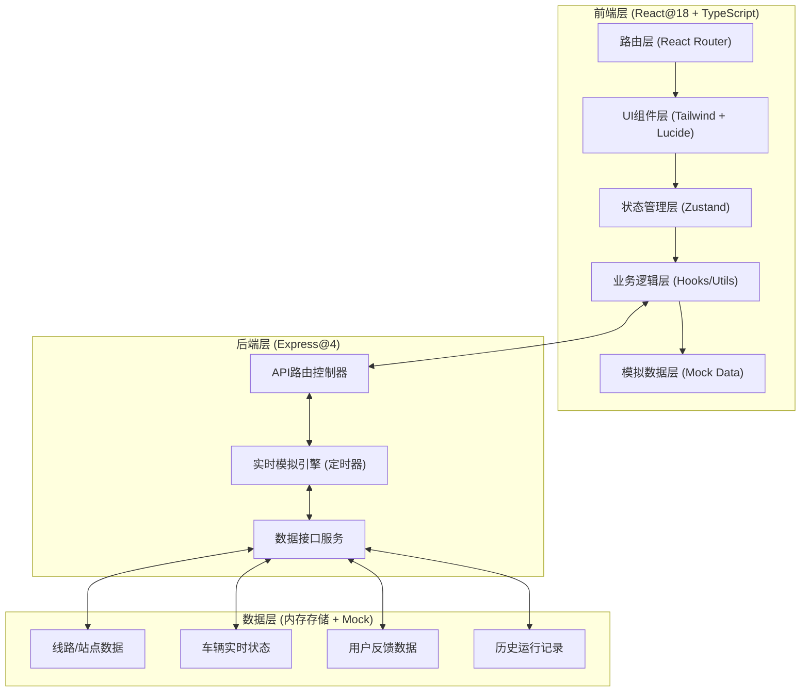

## 1. 架构设计



---

## 2. 技术描述

- **前端框架**：React@18 + TypeScript@5 + Vite@5
- **后端框架**：Express@4（用于提供API和WebSocket模拟）
- **样式方案**：Tailwind CSS@3 + CSS 变量主题系统
- **状态管理**：Zustand@4（全局状态：车辆位置、线路信息、用户设置）
- **路由方案**：React Router DOM@6
- **图标库**：Lucide React
- **图表方案**：Recharts（准点率统计、拥挤度图表）
- **地图方案**：自定义SVG实现园区地图（无需第三方地图SDK，纯前端绘制）
- **模拟引擎**：`setInterval` + 路径插值算法，模拟车辆GPS沿线路移动
- **初始化工具**：vite-init（react-express-ts 模板）
- **数据存储**：服务端内存存储 + Mock初始数据（无需数据库）

---

## 3. 路由定义

| 前端路由 | 页面组件 | 用途 |
|----------|----------|------|
| `/` | `RoleSelect` | 身份选择页（乘客/司机/管理员） |
| `/passenger` | `PassengerHome` | 乘客端首页：地图+线路列表 |
| `/passenger/route/:id` | `RouteDetail` | 线路详情：站点+ETA+提醒+反馈 |
| `/driver` | `DriverConsole` | 司机端控制台 |
| `/admin` | `AdminDashboard` | 管理员统计分析页 |

| 后端API | 方法 | 用途 |
|---------|------|------|
| `/api/routes` | GET | 获取所有线路列表及状态 |
| `/api/routes/:id` | GET | 获取单条线路详情+站点+车辆位置 |
| `/api/vehicles/report` | POST | 司机端上报GPS位置 |
| `/api/vehicles/:id/crowd` | POST | 乘客提交拥挤度反馈 |
| `/api/reminders` | POST | 创建立到站提醒订阅 |
| `/api/stats/punctuality` | GET | 获取准点率统计数据 |
| `/api/stats/trajectory/:routeId` | GET | 获取历史轨迹数据 |

---

## 4. 核心类型定义

```typescript
// 站点
interface Station {
  id: string;
  name: string;
  index: number;
  x: number;      // SVG坐标X
  y: number;      // SVG坐标Y
  eta?: number;   // 到达预估(分钟)
}

// 线路
interface Route {
  id: string;
  name: string;
  color: string;
  stations: Station[];
  pathPoints: { x: number; y: number }[];  // SVG路径坐标点
  operatingHours: string;
  interval: number;  // 发车间隔(分钟)
}

// 车辆
interface Vehicle {
  id: string;
  plateNumber: string;
  routeId: string;
  driverName: string;
  status: 'idle' | 'running' | 'arrived';
  progress: number;       // 0-1 在线路上的进度百分比
  currentStationIndex: number;
  crowdLevel: 'loose' | 'normal' | 'crowded';
  crowdVotes: { loose: number; normal: number; crowded: number };
  position: { x: number; y: number };
  lastReportTime: number;
  startTimestamp?: number;
}

// 到站提醒
interface Reminder {
  id: string;
  routeId: string;
  vehicleId: string;
  stationId: string;
  userId: string;
  notified: boolean;
  createdAt: number;
}

// 历史运行记录
interface TripRecord {
  id: string;
  vehicleId: string;
  routeId: string;
  date: string;
  startTime: number;
  endTime: number;
  plannedDuration: number;
  actualDuration: number;
  stations: { stationId: string; actualArrival: number; plannedArrival: number }[];
}

// 准点率统计
interface PunctualityStats {
  routeId: string;
  routeName: string;
  totalTrips: number;
  onTimeTrips: number;
  onTimeRate: number;  // 0-1
  averageDelay: number; // 平均延迟(分钟)
  dailyData: { date: string; rate: number }[];
}
```

---

## 5. 数据模型（Mock数据）

### 5.1 初始Mock数据说明
- **线路数据**：3条园区线路（环线A、直线B、接驳线C），每条8-12个站点
- **车辆数据**：每条线路2-3辆车，初始随机分布在各站之间
- **历史记录**：最近30天的模拟运行数据，准点率85%-96%区间
- **用户反馈**：预置各车辆的拥挤度投票数

### 5.2 GPS模拟引擎算法
```
// 车辆位置沿路径插值
输入：线路pathPoints数组、进度progress (0-1)
计算：
  1. 总路径长度 = 各段距离之和
  2. 当前位置距离 = 总路径长度 × progress
  3. 定位所在线段，做线性插值得到(x,y)
  4. 根据经过站点距离判断currentStationIndex
输出：position, currentStationIndex
```

### 5.3 ETA预估算法
```
ETA(stationIndex) = 
  (stationIndex - currentStationIndex) × 平均每站行驶时间
  + 修正因子(当前路段距离/路段速度)
平均每站行驶时间 ≈ 3分钟
```

---

## 6. 项目目录结构

```
ljy-35/
├── .trae/documents/          # 项目文档
├── shared/
│   └── types/                # 前后端共享类型定义
├── api/                      # Express后端
│   ├── index.ts              # 服务器入口
│   ├── routes/               # API路由
│   ├── services/             # 业务逻辑（模拟引擎）
│   └── mock/                 # Mock初始数据
├── src/                      # React前端
│   ├── main.tsx
│   ├── App.tsx
│   ├── router/               # 路由配置
│   ├── pages/                # 页面组件
│   │   ├── RoleSelect.tsx
│   │   ├── PassengerHome.tsx
│   │   ├── RouteDetail.tsx
│   │   ├── DriverConsole.tsx
│   │   └── AdminDashboard.tsx
│   ├── components/           # 可复用组件
│   │   ├── ParkMap/          # SVG园区地图组件
│   │   ├── RouteCard.tsx
│   │   ├── StationTimeline.tsx
│   │   ├── CrowdFeedback.tsx
│   │   ├── StatsCharts.tsx
│   │   └── Sidebar.tsx
│   ├── store/                # Zustand状态管理
│   ├── hooks/                # 自定义hooks
│   ├── utils/                # 工具函数
│   └── styles/               # 全局样式+主题
└── package.json
```
